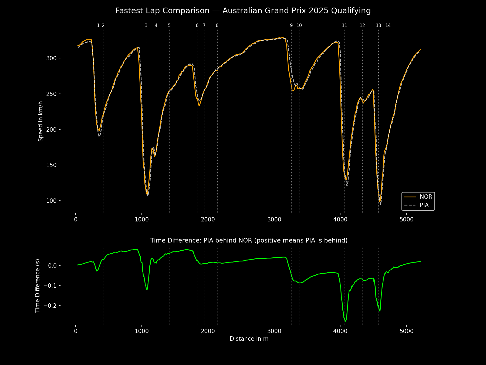

# 🏎️ F1 Fastest Lap Qualifying Comparison (2025)

[](https://f1qualicomparison-arpan.streamlit.app/)

This interactive Streamlit app lets you compare the **fastest qualifying laps** of any two drivers from the 2025 F1 season. Built with [FastF1](https://github.com/theOehrly/Fast-F1), [Plotly](https://plotly.com/), and enhanced using **Gemini AI** for instant performance insights.

🔗 **Live Demo**: [f1qualicomparison-arpan.streamlit.app](https://f1qualicomparison-arpan.streamlit.app/)

---

## 🚦 What Can You Do?

- Select any completed F1 race from 2025.
- Choose two drivers and compare their fastest qualifying laps.
- Visualize:
  - Speed traces across the entire lap.
  - Time deltas at every point on the track.
  - Corner-level insights (with annotations).
- 🔍 Use **Gemini AI** to instantly generate:
  - 🔹 Short summaries of lap performance
  - 🔸 Detailed engineering-style breakdowns

---

## 🧪 How to Use It (Live App)

1. 👉 Visit the app: [https://f1qualicomparison-arpan.streamlit.app](https://f1qualicomparison-arpan.streamlit.app)
2. 🧑‍🔧 On the **sidebar**, paste your **Gemini API key** (free from Google):
   - You can get one here: [https://makersuite.google.com/app/apikey](https://makersuite.google.com/app/apikey)
3. 📅 Choose a past race.
4. 🚗 Select two drivers.
5. 📈 View interactive plots and scroll down to run Gemini-powered analysis.

💡 Don’t worry — your API key is only used temporarily in your session and **never stored**.

---

## 📦 Tech Stack

- 🏁 [FastF1](https://theoehrly.github.io/Fast-F1/) – for real lap telemetry and corner data
- 📊 [Plotly](https://plotly.com/python/) – dynamic graphs
- 🌐 [Streamlit](https://streamlit.io) – frontend deployment
- 🧠 [Gemini API](https://ai.google.dev) – AI-powered analysis
- 🧪 [Matplotlib] – static visual export

---

## 📸 Example Output

<p align="center">
  
  <br>
  <em>Overlay of speed & time difference with corner markers</em>
</p>

---

## 🛠️ Local Setup (Optional)

```bash
# Clone the repo
git clone https://github.com/yourusername/f1-lap-comparison.git
cd f1-lap-comparison

# Install dependencies
pip install -r requirements.txt

# Run the app
streamlit run streamlit_app.py
